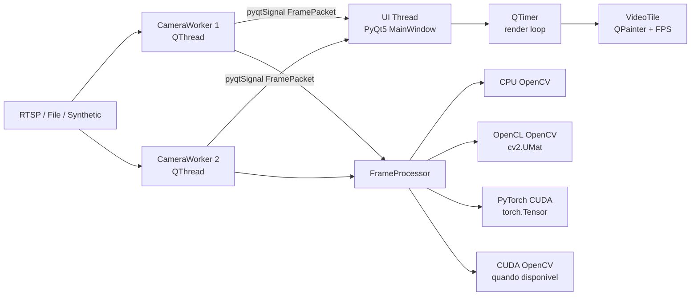

# GESEC Mini VMS Viewer

<video controls autoplay loop muted playsinline width="100%">
  <source src="https://raw.githubusercontent.com/brenpaiva/Sistema-De-Gerenciamento-de-V-deo/main/assets/gravacao.mp4" type="video/mp4">
</video>

Se o player acima não aparecer no seu navegador do GitHub, abra a gravação aqui: [assets/gravacao.mp4](assets/gravacao.mp4)


Aplicação desktop em Python para de visualização de câmeras. A entrega simula um mini VMS com PyQt5, OpenCV, captura em threads separadas, renderização fluida na UI e processamento com GPU opcional.

## O Que Foi Entregue

- Interface PyQt5 com dois quadrantes de vídeo.
- Botões de `Iniciar`, `Pausar` e `Parar`.
- FPS real de renderização em cada quadrante.
- Um `CameraWorker` por câmera rodando fora da UI thread.
- Envio de frames para a UI via `pyqtSignal`.
- Processamento acelerado/fallback entre CPU, OpenCL, OpenCV CUDA e PyTorch CUDA.
- Tentativa best-effort de decodificação por hardware via OpenCV/FFmpeg quando o ambiente suporta.
- Suporte a fontes `synthetic`, `file`, `rtsp` e `device`.
- Configuração por YAML.
- Testes unitários, benchmark CLI e benchmark sintético pela interface.

## Evolução Para VMS Completo

- Menu lateral com `Monitor`, `Câmeras`, `Gravação`, `PTZ`, `Eventos`, `Configurações`, `Benchmark` e `Sobre`.
- Logo do diretório convertida para `assets/logo.png` e `assets/logo.ico` para uso no PyQt5.
- Cadastro de câmeras pela interface, com campos RTSP, ONVIF, credenciais, FPS, resolução, ativo/inativo e PTZ.
- Persistência das câmeras editadas em `config/user.yaml`, preservando `config/demo.yaml`.
- Gravação manual local e gratuita em `recordings/<camera_id>/YYYYMMDD_HHMMSS.mp4`.
- Captura de snapshot em `snapshots/<camera_id>/`, tela cheia por câmera, reconexão e layouts 1/2/4/9.
- Controle PTZ via ONVIF com direção, zoom e presets quando a câmera suportar.
- Tela `Eventos` como histórico operacional único; logs técnicos ficam no terminal/logging.
- Demo padrão sintética/offline para avaliação reproduzível em qualquer máquina.
- Configuração RTSP pública opcional em `config/rtsp.example.yaml`; URLs repetidas são espelhadas internamente para evitar abrir várias conexões no mesmo servidor.
- Modo automático leve: captura apenas câmeras visíveis, preserva câmeras em gravação, reduz FPS/renderização em layouts maiores e grava em fila dedicada.
- Tela `Benchmark` para medir desempenho sintético local sem depender de rede, RTSP ou câmera real.

## Como Rodar

Ambiente recomendado: Linux ou WSL com suporte gráfico.

```bash
sudo apt update
sudo apt install -y python3 python3-venv ffmpeg libgl1 libegl1 libxcb-cursor0

python3 -m venv .venv
source .venv/bin/activate
pip install --upgrade pip
pip install -r requirements.txt

python -m gesec_viewer --config config/demo.yaml --gpu auto --hw-decode auto
```

Esse comando usa `config/demo.yaml`, que não depende de internet, câmera física ou RTSP externo.

Para habilitar CUDA real via PyTorch, sem recompilar OpenCV:

```bash
pip install -r requirements-cuda.txt
python -m gesec_viewer --config config/demo.yaml --gpu torch
```

Observação sobre GPU: `opencv-python` instalado via `pip` normalmente não vem compilado com CUDA nem com todos os caminhos de decodificação por hardware. Por isso o app tenta hardware decode via propriedades do OpenCV/FFmpeg quando possível e mantém fallback de processamento entre OpenCV CUDA, PyTorch CUDA, OpenCL e CPU.

Para forçar CPU:

```bash
python -m gesec_viewer --config config/demo.yaml --gpu cpu
```

Para tentar CUDA explicitamente:

```bash
python -m gesec_viewer --config config/demo.yaml --gpu cuda
```

Para usar PyTorch CUDA explicitamente:

```bash
python -m gesec_viewer --config config/demo.yaml --gpu torch
```

Para tentar OpenCL explicitamente:

```bash
python -m gesec_viewer --config config/demo.yaml --gpu opencl
```

Se o OpenCV instalado não tiver CUDA habilitado, a aplicação informa no terminal e tenta PyTorch CUDA/OpenCL antes de continuar em CPU.

## Configuração

A demo padrão usa streams sintéticos para ser reproduzível em qualquer máquina:

```yaml
cameras:
  - id: portaria
    name: "Portaria - Demo"
    type: synthetic
    url: "synthetic://portaria"
    loop: true
    target_fps: 30
    render_size: [640, 360]
    hardware_decode: auto
```

Para câmeras reais, use `config/rtsp.example.yaml` como base:

```bash
python -m gesec_viewer --config config/rtsp.example.yaml --gpu auto
```

As câmeras cadastradas ou editadas pela interface são salvas em `config/user.yaml`. O parâmetro `--config` é respeitado exatamente: para abrir a configuração do usuário, execute `python -m gesec_viewer --config config/user.yaml --gpu auto`.

Para arquivos locais, gere vídeos de teste:

```bash
python scripts/generate_demo_videos.py
python -m gesec_viewer --config config/file.example.yaml --gpu auto
```

## Arquitetura



A UI não captura vídeo diretamente. Cada câmera fica em um `QThread`, e a UI recebe apenas pacotes de frame já processados. Isso evita bloquear eventos, cliques, repaints e timers da interface.

A UI também não tenta renderizar todos os frames recebidos. Ela mantém o frame mais recente por câmera e usa um `QTimer` para desenhar. Esse desenho reduz backlog quando o produtor entrega frames mais rápido que a tela consegue exibir.

## Atendimento Aos Requisitos Do Desafio

| Requisito | Implementação |
|---|---|
| Interface PyQt5 | `MainWindow` em `gesec_viewer/widgets.py` |
| Dois ou mais quadrantes | Layouts 1/2/4/9 e `config/demo.yaml` com 2 streams sintéticos |
| Iniciar/Pausar/Parar | Botões conectados no monitor |
| FPS real na tela | Overlay por tile contado no `paintEvent()` |
| Captura fora da UI thread | `CameraWorker` executado em `QThread` |
| Comunicação thread -> UI | `pyqtSignal` emitindo `FramePacket` |
| Opção B de GPU | `FrameProcessor` com OpenCV CUDA, PyTorch CUDA, OpenCL ou CPU |
| Opção A complementar | Tentativa `CAP_PROP_HW_ACCELERATION`/FFmpeg best-effort |
| Reconexão | Loop de reconexão no `CameraWorker` |
| Benchmark | Tela `Benchmark` e `scripts/benchmark.py` |

## Requisito De GPU

A entrega cobre a Opção B de forma efetiva: o processamento dos frames pode usar OpenCV CUDA, PyTorch CUDA, OpenCL ou CPU fallback. Como complemento, o `CameraWorker` também tenta habilitar a Opção A de forma best-effort: ele abre fontes com FFmpeg (`cv2.CAP_FFMPEG`) e, quando `--hw-decode auto` está ativo, tenta configurar `CAP_PROP_HW_ACCELERATION`, `VIDEO_ACCELERATION_ANY` e `CAP_PROP_HW_DEVICE` no `VideoCapture`.

Essa aceleração depende da build local do OpenCV/FFmpeg e dos drivers disponíveis, como NVDEC/CUVID, VAAPI ou QSV. Se o ambiente não expuser essas propriedades, o app registra o fallback e continua funcionando.

Esse desenho evita depender de um ambiente específico para funcionar: se a decodificação acelerada não estiver disponível, a captura segue em CPU e o processamento ainda pode aproveitar GPU/OpenCL quando houver suporte.

## CPU, GPU E Memória

O frame capturado pelo OpenCV chega primeiro na memória do sistema, a memória Host. No modo CPU, o redimensionamento e a conversão BGR para RGB acontecem diretamente com OpenCV.

No modo CUDA, o `FrameProcessor` faz:

1. `upload` do frame para um `cv2.cuda_GpuMat`, transferindo Host para Device.
2. `cv2.cuda.resize` e `cv2.cuda.cvtColor` na GPU.
3. `download` de volta para Host, porque `QImage/QPixmap` renderiza a partir da memória acessível pela UI.

Esse caminho demonstra o controle explícito da transferência Host/Device. A aplicação cai para CPU caso a build do OpenCV não tenha CUDA, o que é comum em instalações via `pip`.

No modo OpenCL, o `FrameProcessor` usa `cv2.UMat`, permitindo que o OpenCV execute operações como `resize` e `cvtColor` no backend OpenCL disponível. Em placas NVIDIA no Windows, esse backend pode aparecer como `NVD3D11`.

No modo PyTorch CUDA, o frame sai da memória Host como `numpy.ndarray`, sobe para a GPU como `torch.Tensor`, passa por reorder BGR/RGB e resize com `torch.nn.functional.interpolate`, e volta para Host para ser renderizado pela UI.

## FFmpeg, RTSP E Decodificação Por Hardware

O `CameraWorker` tenta abrir fontes com backend FFmpeg (`cv2.CAP_FFMPEG`), configura buffer pequeno para reduzir latência e aplica hardware decode best-effort quando o OpenCV local oferece suporte. Em produção, a decodificação por hardware pode exigir OpenCV compilado com FFmpeg/NVIDIA e codecs como NVDEC/CUVID disponíveis no sistema.

Exemplo de verificação:

```bash
nvidia-smi
python - <<'PY'
import cv2
print(cv2.__version__)
print(cv2.cuda.getCudaEnabledDeviceCount() if hasattr(cv2, "cuda") else 0)
print(cv2.ocl.haveOpenCL() if hasattr(cv2, "ocl") else False)
PY

python - <<'PY'
import torch
print(torch.__version__)
print(torch.cuda.is_available())
print(torch.cuda.get_device_name(0) if torch.cuda.is_available() else "no cuda")
PY
```

## Testes E Benchmark

```bash
python -m compileall -q gesec_viewer tests
pytest
python scripts/benchmark.py --gpu cpu
python scripts/benchmark.py --gpu auto
python scripts/benchmark.py --gpu torch
python scripts/benchmark.py --gpu opencl
python scripts/benchmark.py --gpu cuda
```

Referência medida nesta revisão em CPU, usando o perfil econômico de renderização 426x240 usado em layouts maiores e na demo RTSP opcional:

```text
python scripts/benchmark.py --gpu cpu --frames 1200 --size 854x480 --render-size 426x240
Backend: cpu
OpenCV: 4.13.0
FPS: 1663.72
```

O modo automático leve usa esse perfil econômico nos layouts grandes, evita renderizar telas ocultas e não abre workers para câmeras fora do layout, exceto quando uma câmera oculta está gravando.

Na interface, a tela `Benchmark` roda um teste sintético em `QThread` usando o mesmo `FrameProcessor` do VMS. Ela mostra FPS total, FPS estimado por câmera, latência média, p95, backend selecionado e um veredito:

- `Excelente`: pelo menos 3x a meta do perfil.
- `Bom`: pelo menos 1.5x a meta.
- `Aceitável`: atinge a meta.
- `Ruim`: fica abaixo da meta ou apresenta latência p95 acima de 200 ms.

Os perfis são `2 câmeras`, `4 câmeras` e `9 câmeras`. O teste é local e reproduzível; ele não mede qualidade de rede RTSP nem decodificação NVDEC real.

## Como Validar Rapidamente

```bash
python -m compileall -q gesec_viewer tests
python -m pytest -q
python scripts/benchmark.py --gpu cpu --frames 300 --size 640x360 --render-size 640x360
python -m gesec_viewer --config config/demo.yaml --gpu auto --hw-decode auto
```

## Observações

O foco da entrega é demonstrar arquitetura, concorrência, renderização sem travar UI, fallback CPU/GPU e entendimento do fluxo de vídeo. A demo sintética existe para que a avaliação seja reproduzível mesmo sem acesso a câmeras reais; os RTSPs públicos ficam como demonstração extra.
